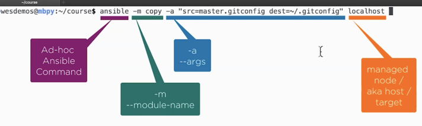

# Ansible

## Useful links

[Ansible Documentation](https://docs.ansible.com/ansible/latest/index.html#)

- [Installation Guide](https://docs.ansible.com/ansible/latest/installation_guide/index.html)

- [User Guide](https://docs.ansible.com/ansible/latest/user_guide/index.html)

- [Modules Index](https://docs.ansible.com/ansible/latest/modules/modules_by_category.html)

### Ansible ad-hoc-configuration

 

Sample:  
Make a copy of your ```.gitconfig``` and save it as ```master.gitconfig```. Then remove the ```.gitconfig```from your system.

```bash
# Make a copy of your
cp .gitconfig master.gitconfig

# Remove the .gitconfig file
rm .gitconfig

# check if your .gitconfig file was removed, you should get an error message
git config --global --list

fatal: unable to read config file '/Users/tomipeltonen/.gitconfig': No such file or directory


# copy gitconfig file using ansible ad-hoc
ansible -m copy -a "src=master.gitconfig dest=~/.gitconfig" localhost

# dry run to see if anything would be changed
ansible -m copy -a "src=master.gitconfig dest=~/.gitconfig" --check localhost

# dry run with diff of changes
ansible -m copy -a "src=master.gitconfig dest=~/.gitconfig" --check --diff localhost

# apply changes and show diff of what was changed
ansible -m copy -a "src=master.gitconfig dest=~/.gitconfig" --diff localhost
```
