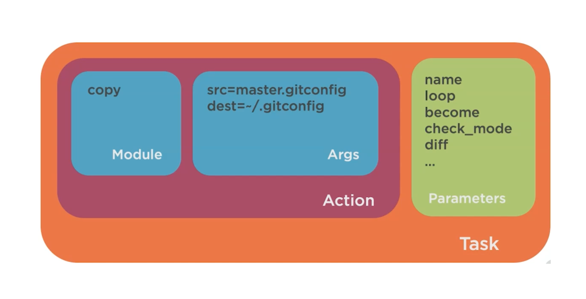

# Ansible

Ansible is an open-source agentless automation tool, or platform, used for IT tasks such as configuration management, application deployment, intraservice orchestration, and provisioning. Automation is crucial these days, with IT environments that are too complex and often need to scale too quickly for system administrators and developers to keep up if they had to do everything manually. Automation simplifies complex tasks, not just making developers’ jobs more manageable but allowing them to focus attention on other tasks that add value to an organization. In other words, it frees up time and increases efficiency. And Ansible, as noted above, is rapidly rising to the top in the world of automation tools.

## Useful links

The samples I use is taken from the course [Getting Started with Ansible](https://app.pluralsight.com/library/courses/getting-started-ansible/table-of-contents) by [Wes Higbee](https://github.com/g0t4/course-ansible-getting-started).  
_Note: This is for my own learning and understanding of Ansible._

[Ansible Documentation](https://docs.ansible.com/ansible/latest/index.html#)

- [Installation Guide](https://docs.ansible.com/ansible/latest/installation_guide/index.html)

- [User Guide](https://docs.ansible.com/ansible/latest/user_guide/index.html)

- [Modules Index](https://docs.ansible.com/ansible/latest/modules/modules_by_category.html)

### First some good to know stuff

[Install bat a cat clone with wings](https://github.com/sharkdp/bat)

```bash
ansible -m homebrew -a "name=bat state=latest" localhost
```

Use bat for reading the documentation

```bash
ansible-doc copy | bat --language yml
```

Get information about localhost environment

```bash
ansible -m setup localhost
```

Check what package manager the targets are using with module "setup"
[Package Module](https://docs.ansible.com/ansible/latest/modules/package_module.html)

- This module actually calls the pertinent package modules for each system (apt, yum, etc).
- For Windows targets, use the win_package module instead.
Examples

```bash
ansible -m setup -a "filter=ansible_pkg_mgr" all
```

### Ansible ad-hoc configuration


Sample:  
Make a copy of your ```.gitconfig``` and save it as ```master.gitconfig```. Then remove the ```.gitconfig```from your system.

```bash
# Make a copy of your
cp .gitconfig master.gitconfig

# Remove the .gitconfig file
rm .gitconfig

# check if your .gitconfig file was removed, you should get an error message
git config --global --list

fatal: unable to read config file '/Users/tomipeltonen/.gitconfig': No such file or directory


# copy gitconfig file using ansible ad-hoc
ansible -m copy -a "src=master.gitconfig dest=~/.gitconfig" localhost

# dry run to see if anything would be changed
ansible -m copy -a "src=master.gitconfig dest=~/.gitconfig" --check localhost

# dry run with diff of changes
ansible -m copy -a "src=master.gitconfig dest=~/.gitconfig" --check --diff localhost

# apply changes and show diff of what was changed
ansible -m copy -a "src=master.gitconfig dest=~/.gitconfig" --diff localhost
```

### How to use the documentation from command line

```bash
ansible-doc -h

# Configuration
# list ansible configuration
ansible-config list


# Modules
# read about the copy module
ansible-doc copy

# continue to find out about return values from the copy module, type  
/RETURN

# List available plugin types:('become', 'cache','callback', 'cliconf', 'connection', 'httpapi','inventory', 'lookup', 'netconf', 'shell', 'module','strategy', 'vars')
ansible-doc -t shell --list
#output:
cmd        Windows Command Prompt
csh        C shell (/bin/csh)
fish       fish shell (/bin/fish)
powershell Windows PowerShell
sh         POSIX shell (/bin/sh)

# Dig deeper to get documentation for plugin sh and so on...
ansible-doc -t shell sh

#output: 
> SHELL    (/usr/local/lib/python3.7/site-packages/ansible/plugins/shell/sh.py)

        This shell plugin is the one you want to use on most Unix systems, it is the most
        compatible and widely installed shell.

# Copy the path and use bat to see the documentation (nice way to read it)
bat /usr/local/lib/python3.7/site-packages/ansible/plugins/shell/sh.py

```

### Ansible playbook



My first simple playbook.yml

```bash
---
# ansible -m copy -a "src=..~/master.gitconfig dest=~/.gitconfig" localhost

- name: Ensure ~/.gitconfig copied from master.gitconfig
  #gather_facts: false
  hosts: localhost
  tasks:
  - copy: src="~/master.gitconfig" dest="~/.gitconfig" 

- name: Ensure homebrew packages are installed.
  hosts: localhost
  tasks:
  - homebrew: name=bat state=latest
  - homebrew: 
      name: jq
      state: latest
# ansible -m homebrew -a "name=bat state=latest" localhost
# ansible -m homebrew -a "name=jq state=latest" localhost
```

Run a playbook

```bash
ansible-playbook playbook.yml

# Fore more output from the run add different verbose levels by adding -v, -vv , -vvv or -vvvv
ansible-playbook playbook.yml -v
```

### Inventory list

For this sample you need to setup a couple of virtual machines in Virtual Box.
From the /course-ansible-getting-started/tree/master/inventory/vagrants run:

```bash
vagrant status
# output should be like this
Current machine states:

ubuntu10                  not created (virtualbox)
ubuntu11                  not created (virtualbox)
centos20                  not created (virtualbox)
centos21                  not created (virtualbox)

This environment represents multiple VMs. The VMs are all listed
above with their current state. For more information about a specific
VM, run `vagrant status NAME`.

# then set them up
vagrant up
```

```bash
# lists the ansible inventory
ansible-inventory --list

# shows the graph of the inventory
ansible-inventory --graph

# the result in my environment when running the above command
@all:
  |--@ungrouped:
  |  |--localhost
  |--@vagrant:
  |  |--@centos:
  |  |  |--centos20
  |  |  |--centos21
  |  |--@ubuntu:
  |  |  |--ubuntu10
  |  |  |--ubuntu11

# If you want more add the --vars to show the variables for each node
ansible-inventory --graph --vars

# check if git config exists on the virtual machines and localhost within the ansible inventory
ansible -m command -a "git config --global --list" all
ansible -m command -a "git config --global --list" ungrouped
ansible -m command -a "git config --global --list" vagrant
ansible -m command -a "git config --global --list" centos
ansible -m command -a "git config --global --list" centos20

```

Now you can play around with the git config sample and see what happens

```bash
ansible-playbook playbook.yml
```

When you are finished playing around you can remove the virtual machines from virtual box

```bash
vagrant destroy -f
```