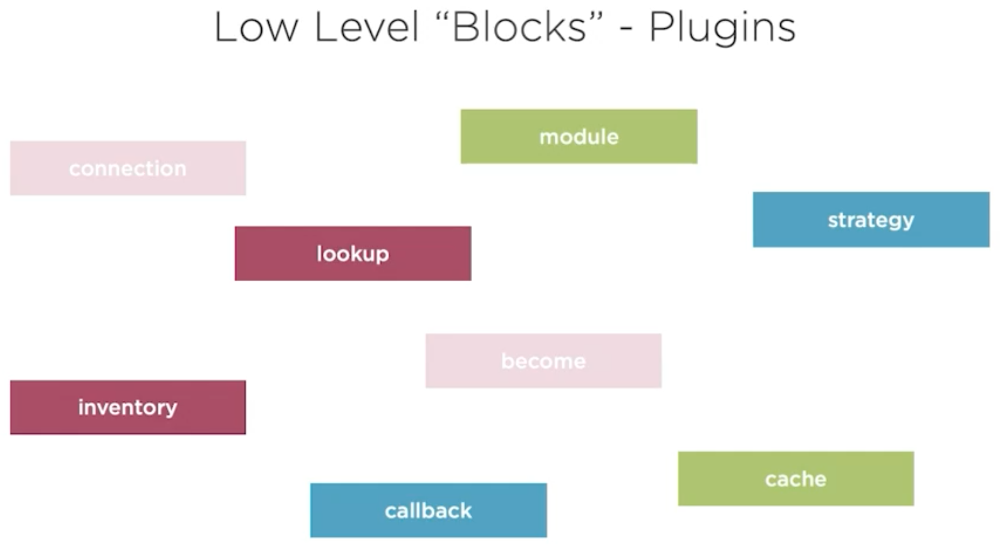

# Ansible

Ansible is an open-source agentless automation tool, or platform, used for IT tasks such as configuration management, application deployment, intraservice orchestration, and provisioning. Automation is crucial these days, with IT environments that are too complex and often need to scale too quickly for system administrators and developers to keep up if they had to do everything manually. Automation simplifies complex tasks, not just making developers’ jobs more manageable but allowing them to focus attention on other tasks that add value to an organization. In other words, it frees up time and increases efficiency. And Ansible, as noted above, is rapidly rising to the top in the world of automation tools.

## Useful links

The samples I use is taken from the course [Getting Started with Ansible](https://app.pluralsight.com/library/courses/getting-started-ansible/table-of-contents) by [Wes Higbee](https://github.com/g0t4/course-ansible-getting-started).  
_Note: This is for my own learning and understanding of Ansible._

[Ansible on GitHub](https://github.com/ansible/ansible)

[Ansible Galaxy](https://galaxy.ansible.com/)

[Ansible Documentation](https://docs.ansible.com/ansible/latest/index.html#)

- [Installation Guide](https://docs.ansible.com/ansible/latest/installation_guide/index.html)

- [User Guide](https://docs.ansible.com/ansible/latest/user_guide/index.html)

- [Modules Index](https://docs.ansible.com/ansible/latest/modules/modules_by_category.html)

### First some "good to know stuff"

How to get [shell-completion](https://docs.ansible.com/ansible/devel/installation_guide/intro_installation.html#shell-completion) to make it easier to find what you are looking for.

```bash
# Installing argcomplete with apt
sudo apt install python-argcomplete

# Installing argcomplete with pip
pip install argcomplete

# Configure argcomplete
sudo activate-global-python-argcomplete

# Type ansible- then tab to see what options you have 
ansible- 

# result:
ansible-config      ansible-console     ansible-galaxy      ansible-playbook    ansible-test        
ansible-connection  ansible-doc         ansible-inventory   ansible-pull        ansible-vault
```

[Install jq a command-line JSON processor](https://github.com/stedolan/jq)

[Install a command-line fuzzy finder](https://github.com/junegunn/fzf)

[Install bat a cat clone with wings](https://github.com/sharkdp/bat)

```bash
# Windows
choco install bat
#or
scoop install bat

# Mac
ansible -m homebrew -a "name=bat state=latest" localhost

# Linux
apt install bat

# If you install bat this way, please note that the executable may be installed as batcat instead of bat (due to a name clash with another package). You can set up a bat -> batcat symlink or alias to prevent any issues that may come up because of this and to be consistent with other distrutions:

mkdir -p ~/.local/bin
ln -s /usr/bin/batcat ~/.local/bin/bat

```

Use bat for reading the documentation

```bash
ansible-doc copy | bat --language yml
```

Get information about localhost environment

```bash
ansible -m setup localhost
```

Check what package manager the targets are using with module "setup"
[Package Module](https://docs.ansible.com/ansible/latest/modules/package_module.html)

- This module actually calls the pertinent package modules for each system (apt, yum, etc).
- For Windows targets, use the win_package module instead.
Examples

```bash
ansible -m setup -a "filter=ansible_pkg_mgr" all
```

### Ansible ad-hoc configuration


Sample:  
Make a copy of your ```.gitconfig``` and save it as ```master.gitconfig```. Then remove the ```.gitconfig```from your system.

```bash
# Make a copy of your
cp .gitconfig master.gitconfig

# Remove the .gitconfig file
rm .gitconfig

# check if your .gitconfig file was removed, you should get an error message
git config --global --list

fatal: unable to read config file '/Users/tomipeltonen/.gitconfig': No such file or directory


# copy gitconfig file using ansible ad-hoc
ansible -m copy -a "src=master.gitconfig dest=~/.gitconfig" localhost

# dry run to see if anything would be changed
ansible -m copy -a "src=master.gitconfig dest=~/.gitconfig" --check localhost

# dry run with diff of changes
ansible -m copy -a "src=master.gitconfig dest=~/.gitconfig" --check --diff localhost

# apply changes and show diff of what was changed
ansible -m copy -a "src=master.gitconfig dest=~/.gitconfig" --diff localhost
```

### How to use the documentation from command line

```bash
ansible-doc -h

# For all the main commands use -h to get help

# Configuration
# list ansible configuration
ansible-config list


# Modules
# read about the copy module
ansible-doc copy

# continue to find out about return values from the copy module, type  
/RETURN

# List available plugin types:('become', 'cache','callback', 'cliconf', 'connection', 'httpapi','inventory', 'lookup', 'netconf', 'shell', 'module','strategy', 'vars')
ansible-doc -t shell --list

#output:
cmd        Windows Command Prompt
csh        C shell (/bin/csh)
fish       fish shell (/bin/fish)
powershell Windows PowerShell
sh         POSIX shell (/bin/sh)

# Dig deeper to get documentation for plugin sh and so on...
ansible-doc -t shell sh

#output: 
> SHELL    (/usr/local/lib/python3.7/site-packages/ansible/plugins/shell/sh.py)

        This shell plugin is the one you want to use on most Unix systems, it is the most
        compatible and widely installed shell.

# Copy the path and use bat to see the documentation (nice way to read it)
bat /usr/local/lib/python3.7/site-packages/ansible/plugins/shell/sh.py

```

Ansible console REPL (Docker)

```bash
docker container run --rm -it python bin/bash

# in the container type first install ansible and
root@0ec6cef6f1cc:/ pip install ansible

# then start using the ansible command
root@0ec6cef6f1cc:/ ansible-console localhost

# then type git and hit tab
root@localhost (1)[f:5]$ git

# result:
git                      github_hooks             github_release           github_webhook_info      gitlab_hook              gitlab_project_variable
git_config               github_issue             github_webhook           gitlab_deploy_key        gitlab_hooks             gitlab_runner
github_deploy_key        github_key               github_webhook_facts     gitlab_group             gitlab_project           gitlab_user

# Choose git_config module and hit tab
root@localhost (1)[f:5]$ git_config 
list_all=  name=      repo=      scope=     state=     value=     

# List the global git configuration and you see that there is nothing yet
root@localhost (1)[f:5]$ git_config list_all=yes scope=global
localhost | SUCCESS => {
    "changed": false,
    "config_values": {},
    "msg": ""
}

# Add the user email at global scope and you see that it have changed
root@localhost (1)[f:5]$ git_config name=user.email value=foo@bar.com scope=global
localhost | CHANGED => {
    "changed": true,
    "msg": "setting changed"
}

# Run the same command again and you see that nothing has changed
# Idempotent is where you call the same function with the same value and the result is exactly the same
root@localhost (1)[f:5]$ git_config name=user.email value=foo@bar.com scope=global
localhost | SUCCESS => {
    "changed": false,
    "msg": ""
}

# List the global git configuration and you see that there is a user email now
root@localhost (1)[f:5]$ git_config list_all=yes scope=global
localhost | SUCCESS => {
    "changed": false,
    "config_values": {
        "user.email": "foo@bar.com"
    },
    "msg": ""
}

```

### Ansible playbook


My first simple playbook.yml

```bash
---
# ansible -m copy -a "src=..~/master.gitconfig dest=~/.gitconfig" localhost

- name: Ensure ~/.gitconfig copied from master.gitconfig
  #gather_facts: false
  hosts: localhost
  tasks:
  - copy: src="~/master.gitconfig" dest="~/.gitconfig" 

- name: Ensure homebrew packages are installed.
  hosts: localhost
  tasks:
  - homebrew: name=bat state=latest
  - homebrew: 
      name: jq
      state: latest
# ansible -m homebrew -a "name=bat state=latest" localhost
# ansible -m homebrew -a "name=jq state=latest" localhost
```

Run a playbook

```bash
ansible-playbook playbook.yml

# Fore more output from the run add different verbose levels by adding -v, -vv , -vvv or -vvvv
ansible-playbook playbook.yml -v
```

### Inventory list

For this sample you need to setup a couple of virtual machines in Virtual Box.
From the /course-ansible-getting-started/tree/master/inventory/vagrants run:

```bash
vagrant status
# output should be like this
Current machine states:

ubuntu10                  not created (virtualbox)
ubuntu11                  not created (virtualbox)
centos20                  not created (virtualbox)
centos21                  not created (virtualbox)

This environment represents multiple VMs. The VMs are all listed
above with their current state. For more information about a specific
VM, run `vagrant status NAME`.

# then set them up
vagrant up
```

```bash
# lists the ansible inventory
ansible-inventory --list

# shows the graph of the inventory
ansible-inventory --graph

# You can always use the -h for help to get more info
ansible-inventory -h

# the result in my environment when running the above command
@all:
  |--@ungrouped:
  |  |--localhost
  |--@vagrant:
  |  |--@centos:
  |  |  |--centos20
  |  |  |--centos21
  |  |--@ubuntu:
  |  |  |--ubuntu10
  |  |  |--ubuntu11

# If you want more add the --vars to show the variables for each node
ansible-inventory --graph --vars

# check if git config exists on the virtual machines and localhost within the ansible inventory
ansible -m command -a "git config --global --list" all
ansible -m command -a "git config --global --list" ungrouped
ansible -m command -a "git config --global --list" vagrant
ansible -m command -a "git config --global --list" centos
ansible -m command -a "git config --global --list" centos20

```

Now you can play around with the git config sample and see what happens

```bash
ansible-playbook playbook.yml
```

When you are finished playing around you can remove the virtual machines from virtual box

```bash
vagrant destroy -f
```

### Ansible Docker Container Plugin

Create a playbook as below and name it "create-container.yml"

```yml
---

- name: Ensure pre-reqs for docker_container module 
  hosts: localhost
  tasks:
  - pip: name=docker state=present

- name: Ensure docker containers created
  hosts: localhost
  tasks:
  - name: Ensure docker container started 
    docker_container:
      image: python
      #command: bash
      interactive: yes
      name: "{{ item }}" 
      state: started
    loop: "{{ query('inventory_hostnames', 'containers') }}"

- name: Ensure git configured in containers
  hosts: containers 
  tasks:
  - git_config: scope=global list_all=yes
  - git_config: scope=global name=user.email value=foo@bar.com
  - git_config: scope=global name=user.name value='Foo Bar'
  - git_config: scope=global list_all=yes
```

```bash
# Run the playbook to start the containers
ansible-playbook create-container.yml
```

```bash
# Get into one of the containers to check if everything seems ok after the playbook was run
docker container exec -it ansible_container_test1 bin/bash
```

```bash
# check git config
root@e137024f6355:/ git config --global --list

# result:
user.email=foo@bar.com
user.name=Foo Bar
```

Play around and learn new stuff and when you are had enough it's time to clean up.

Create a playbook as below and name it "create-container.yml"

```yml
- name: Ensure containers are gone 
  hosts: localhost
  tasks:
  - name: Ensure container is absent 
    docker_container:
      name: "{{ item }}" 
      force_kill: yes
      state: absent 
    loop: "{{ query('inventory_hostnames', 'containers') }}"
```

```bash
# Run the playbook and clean up (this only cleans the containers, the image is still on your system)
ansible-playbook cleanup.yml
```

### ansible-pull

[Pulls playbooks from a VCS repo and executes them for the local host](https://docs.ansible.com/ansible/latest/cli/ansible-pull.html)


```bash
# Get help/more info about ansible-pull
ansible-pull -h
```

### Exploiting Roles and Collections with ansible-galaxy

The low level "Blocks" - Modules allow us to configure a specific aspect of our system as the git configuration


Plugins form the core of Ansible 


Then we have a way to compose the low level blocks, roles and collections

Use [Ansible Galaxy](https://galaxy.ansible.com/) to explore the community


```bash
# From command line
ansible-galaxy collection -h

ansible-galaxy role -h

ansible-galaxy role list
```

Install and remove a Role

```bash
# Find the role you are interested in Ansible Galaxy and check always the source before installing
# The -v is added for verbosity

# Install
ansible-galaxy install kosssi.gitconfig -v

# Remove
ansible-galaxy role remove kosssi.gitconfig -v
```
