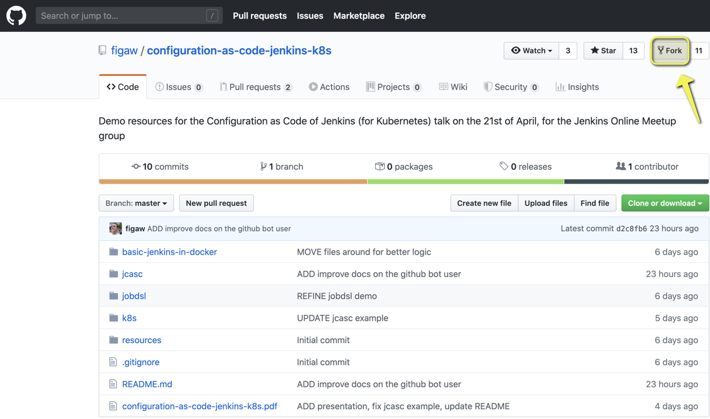

# My Git Kit

## Commands

### Cool links

[Jakub Pawlowicz Git Cheat Sheet](https://github.com/jakubpawlowicz/git-cheat-sheet/blob/master/README.md)

[A Tutorial for Tagging Releases in GIT](https://dev.to/neshaz/a-tutorial-for-tagging-releases-in-git-147e)

### Make folder a Git folder (this will be your local main)

```bash
git init
```

### Create a file with text

```bash
echo "my text" > myfile.txt
```

### Append text to a file

```bash
echo "my new row of text" >> myfile.txt
```

### Add

```bash
# Adds everything in the current repo
git add .
# Adds a file
git add myfile.txt
# Adds several files
git add myfile.txt myfile2.txt
```

### Stage (stage is a synonym to add as the git documentation says)

```bash
git stage myfile.txt
```

### Commit

```bash
git commit -m "my commit comment"
```

```bash
# You can get rid of add and go straight to commit by using -am flag instead
git commit -am "my commit comment"
```

```bash
# If you make a typo in you last commit message you can rewrite/amend the current history
git commit --amend -m "my rewritten commit comment"

# If you forgot to include or add a file with your last commit and keep the history and the latest commit message
git commit --amend --not-edit

# Keep in mind, this only really works if you havent allready pushed your code to a remote repository unless you like to live dangerously and owerite the history on remote.
# Keep also in mind that with this you will owerwrite you collagues pushed code if you haven't got in your branch.
git push origin main --force
```

### Revert

[Git revert](https://www.atlassian.com/git/tutorials/undoing-changes/git-revert)

```bash
# If you realize that you pushed some garbage to the remote repository you can revert a commit and go back to the previous state. Commit history will be kept.
git revert HEAD main
```

### Switch

```bash
# change branch
git switch my/branch

# checkout the previous branch
git switch -

# switch to a new branch
git switch -c new/branch
```

### Checkout

```bash
# change branch
git checkout my/branch

# checkout the previous branch
git checkout -

# checkput/create a new branch
git checkout -b dev

# checkout file
git checkout myfile.txt
```

### Reset

```bash
# Reset a change
git reset HEAD~

# Reset hard (local changes will be lost forever)
git reset --hard origin/main
```

### Clean

```bash
# Clean the repo from random files and build artifacts
git clean -df
```

### Branch

```bash
# Create a new local branch
git branch --create my/branch

# Rename branch localy
# First switch to the branch you want to rename
git branch -M my/branch
```

### Remote

```bash
# Create connection to remote origin in GitHub
# You need to Create the remote origin in git hub first
git remote add <origin> <url>

# Show all the remotes
git remote -v

# This is when cloned from another repo and then add the ref
git remote add ref ssh://git@stash.srv.volvo.com:7999/esw/jcasc-ref.git
git remote set-url ref ssh://git@stash.srv.volvo.com:7999/esw/jcasc-ref.git
```

### Log

```bash
git log --oneline --graph --decorate
```

### Bisect

```bash
git bisect start
git bisect bad
git bisect good 6d010fd

# reset the bisect command
git bisect reset

```

### Working with a long lived branch and the main branch starts diverge a lot

```bash
# In the long lived branch do
git pull --rebase origin main

# then push
git push origin main

# if the push fails this command makes sure that you don't owerwrite any commits on main
git push --force-with-lease --force-if-includes

```

### Clean up local branches after merge and delete on remote

```bash
# 1. List branches in local machine
git branch -a

# 2. Prune/Cleanup the local references to remote branch and dry run to se what you can remove
git remote prune origin --dry-run

# now go ahed and actually prune/cleanup the local references
git remote prune origin

# Again list branches in local machine
git branch -a

# 3. Delete local branch
git branch -d <branchname>
```

### Rebase

[Read more about git rebase](https://medium.com/datadriveninvestor/git-rebase-vs-merge-cc5199edd77c):

```bash
# rebase the 21 last changes to one commit
git rebase  -i HEAD~21

# abort un going rebase
git rebase --abort

# to rewrite/amend the current history of the latest commit
git commit --amend

# once you are satisfied with your changes
git rebase --continue

# Edits the todo
git rebase --edit-todo

# targeting
git rebase main
```

```bash
# Example of rebase
# Rebase main branch to feature branch
# Active branch is feature branch
# Follow the steps below
git pull --rebase origin master

git push --force-with-lease --force-if-includes
```

### Merge

```bash
git merge main
```

### Get original file after a change

```bash
git checkout -- file2.txt
```

### Fetch

```bash
# Fetch latest from origin
git fetch origin/main

# Fetch the latest + prune & verbose
git fetch -pv
```

### Push

```bash
git push -u ref --all
```

### Diff

```bash
# diff a file
git diff origin/main README.md

# diff a branch
git diff vce/ref-main
```

### Branches

```bash
# Delete local branch that you have merged to main
git fetch origin main:main
git checkout main
git pull -pv
git branch -d <local branch name>

# Your default branch name (master) has been renamed (main)
# If you have a local clone, you can update it by running
git branch -m master main
git fetch origin
git branch -u origin/main main

```


### Create a pull request

```bash
git checkout -b feature_jcasc
git push -u origin feature_jcasc
```

Got to BitBucket/GitHub/Azure DevOps:

* Create Pull request
* Select source branch
* Select reviewer

### Tags

Get the latest commits SHA-1

```bash
git log --oneline --graph --decorate
```

```bash
* b38d91e (HEAD -> main, origin/main, origin/HEAD) added new files and cleaned up
* 3928431 Typeo
* 855daee Typeo
* 8073651 Added docker-commands.md
```

Create annotated tag

```bash
git tag -a -m 'The first v1.0.0' v1.0.0 b38d91e
```

Delete

* local

```bash
git tag -d v1.0.0
```

* remote

```bash
  git tag -d v1.0.0
  git push origin :refs/tags/v.1.0.0
```

Get

```bash
git describe --tags --long
```

Push

Tags are not sent to the remote repository by the git push command. We need to explicitly send these tags to the remote server by using the following command:

```bash
git push origin <tagname>
````

We can push all the tags at once by using the below command:

* light weight tags

```bash
git push origin --tags
```

* annotated tags

 ```bash
git push origin --follow-tags
 ```

#### Read more about tags

[How to delete a tag in Git](http://www.manikrathee.com/how-to-delete-a-tag-in-git.html)

[How do you push a tag to a remote repository using Git?](https://stackoverflow.com/questions/5195859/how-do-you-push-a-tag-to-a-remote-repository-using-git)

[What is the difference between an annotated and unannotated tag?](https://stackoverflow.com/questions/11514075/what-is-the-difference-between-an-annotated-and-unannotated-tag)

How to get the latest git commit SHA-1 in a repository:

* How to get the latest git commit SHA-1 id in a repository?

* And how to get the first 8 digits of the SHA-1?

Get the commit SHA-1 hash ID:

```bash
git rev-parse HEAD
```

If you want to get the first 8 digits only, use

```bash
git rev-parse HEAD | cut -c 1-8
```

Here, cut -c 1-8 gives you bytes 1 to 8.

BTW: if you have tags tagging the versions, you may use

```bash
git describe --tags --long
```

to get a better string for IDs like

v2.0-40-gdc25d60
Here, ‘v2.0′ is the latest tag. ’40’ is the number of commits after the ‘v2.0’ tag and ‘gdc25d60’ is the first 8 digits of the commit sha-1 hash ID.

### Fork

#### How to keep your Git-Fork up to date

When it comes to the situation that you fork a repository and you contribute to it, then it could happen that your fork and the upstream are not in sync anymore. So the goal is, that you get a current version of the upstream repository and then you can merge the new changes into your fork.

1. Create a fork of the repo

    A fork is a copy of someone others repository in your account, which can be an independent development project.

    

2. Clone the fork

    Clone the fork as a regular repository, as you always do.

    ```bash
    git clone git@github.com:tpeltone/configuration-as-code-jenkins-k8s.git
    ```

3. Add the upstream

    The original repository is mostly called `upstream`. In our case, we use `figaw/configuration-as-code-jenkins-k8s` for instance. Cd into your fork repository and add the upstream. You can name it however you want, though `upstream` is just best practice.

    ```bash
    git remote add upstream git://github.com/figaw/configuration-as-code-jenkins-k8s.git
    ```

    If you now have a look at your remote URLs, you should see the following:

    ```bash
    git remote -v

    origin git@github.com:tpeltone/configuration-as-code-jenkins-k8s.git (fetch)
    origin git@github.com:tpeltone/configuration-as-code-jenkins-k8s.git (push)
    upstream git://github.com/figaw/configuration-as-code-jenkins-k8s.git (fetch)
    upstream git://github.com/figaw/configuration-as-code-jenkins-k8s.git (push)
    ```

4. Keep the upstream updated

    Now as we have both URLs get tracked, we can update the two sources independently. Fetch whatever you want from the `upstream`

    ```bash
    git fetch upstream
    ```

5. Merge the upstream with your fork

    Then you can merge the changes

    ```bash
    git merge upstream/main main
    ```

    With that, you merge the latest changes from the main branch of the upstream into your local main branch. If you like, you can also use git pull, which is nothing else than fetching and merging in one step.

    Pro Tip: The best way in my eyes is, to rebase because that fetches the latest changes of the upstream branch and replay your work on top of that. Here is, how it works:

    ```bash
    git rebase upstream/main
    ```

### Rename file

```bash
git mv old_filename new_filename
git status
git commit -m "Rename file"
git push origin your-branch
```

### Make file executable on Linux

```bash
 git update-index --chmod=+x <the file>
 ```

### Read the .gitconfig

```bash
cat ~/.gitconfig
```

### Git config

```bash
# add alias git lo instead of git log
git config --global alias.lo "log --graph --pretty=format:'%C(bold red)%h%Creset -%C(bold yellow)%d%Creset %s %C(bold green)(%cr) %C(blue)<%an>%Creset' --abbrev-commit"
```

### Submodule

If you run the below command in the repo folder the submodule will be added to the .gitmodules file

```bash

# Syntax
git submodule add -b <branch-name> <git-reponame> <submodule-name>

# Include branch name
git submodule add -b feature_123 ssh://git@git-vce.srv.volvo.com:7999/al/alva-a-test-linux-platform.git ALVA_IC/Platform

# No branch (uses main)
git submodule add ssh://git@git-vce.srv.volvo.com:7999/al/alva-a-test-linux-platform.git ALVA_IC/Platform

# Deinit all submodules from current repo
git submodule deinit --all

```
