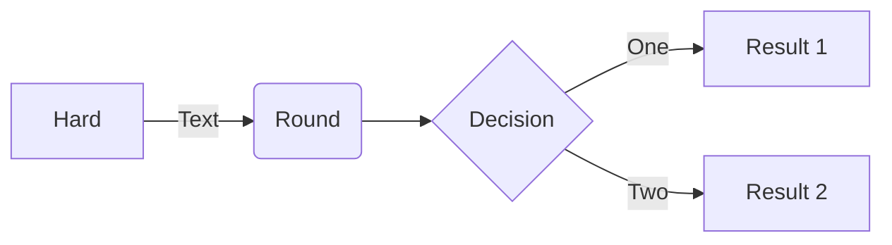
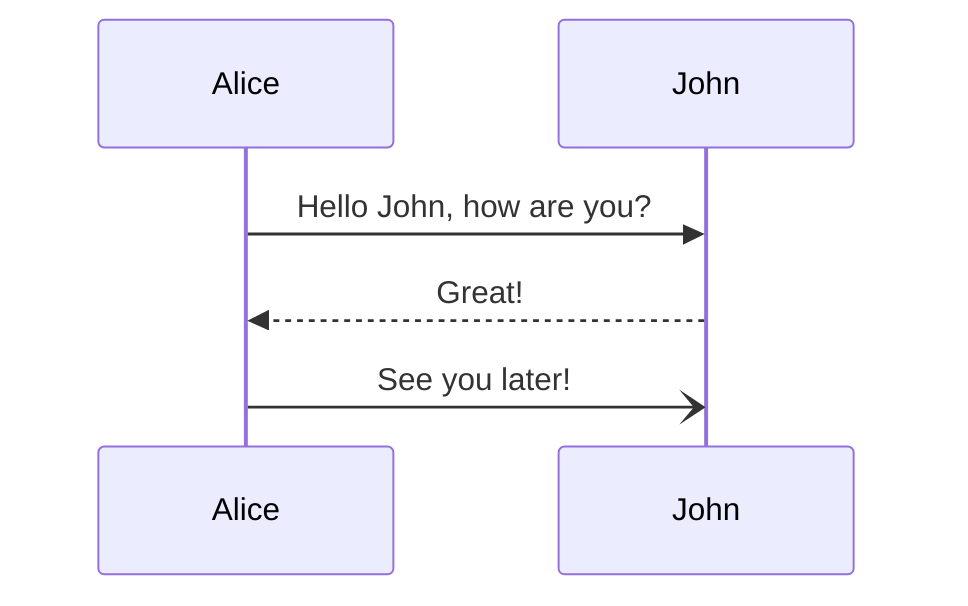
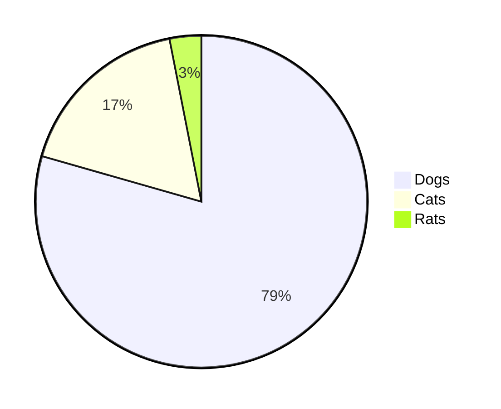
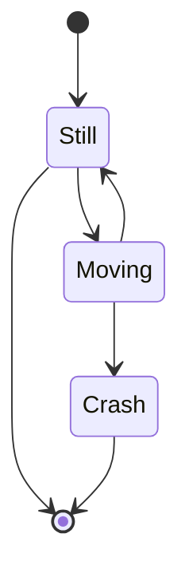

# Mermaid

## Useful links

[About Mermaid](https://mermaid-js.github.io/mermaid/#/)

[Mermaid on GitHub](https://github.com/mermaid-js/mermaid#readme)

[Sequence Diagrams](https://mermaid-js.github.io/mermaid/#/sequenceDiagram)

[Include diagrams in your Markdown files with Mermaid](https://github.blog/2022-02-14-include-diagrams-markdown-files-mermaid/)

[Diagram Syntax](https://mermaid-js.github.io/mermaid/#/n00b-syntaxReference?id=syntax-structure)

### Diagram samples  

__Flowchart__

```shell
flowchart LR
A[Hard] -->|Text| B(Round)
B --> C{Decision}
C -->|One| D[Result 1]
C -->|Two| E[Result 2]
```



__Graph__

```shell
  graph TD;
      A-->B;
      A-->C;
      B-->D;
      C-->D;
```


__Squence Diagram__

```shell
sequenceDiagram
    Alice->>John: Hello John, how are you?
    John-->>Alice: Great!
    Alice-)John: See you later!
```



__Pie chart__

```shell
    pie
    "Dogs" : 386
    "Cats" : 85
    "Rats" : 15
```



__State Diagram__

```shell
stateDiagram-v2
[*] --> Still
Still --> [*]
Still --> Moving
Moving --> Still
Moving --> Crash
Crash --> [*]
```


