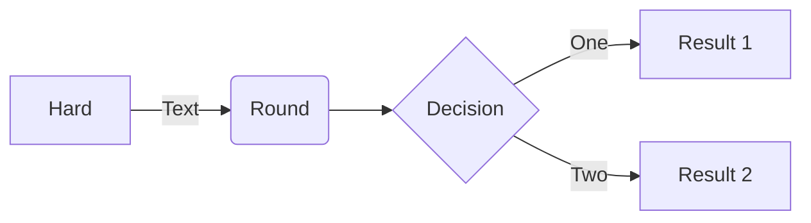
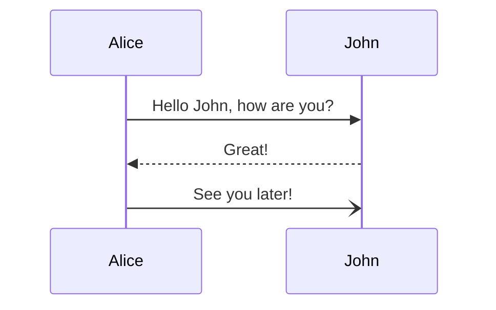
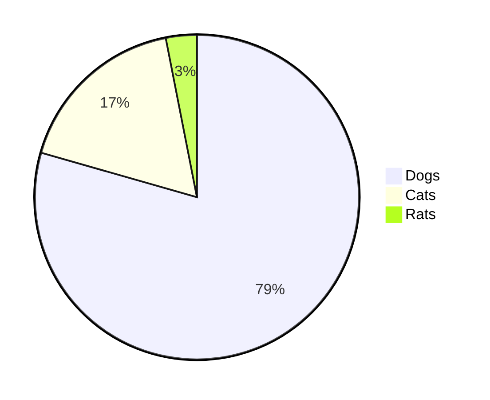
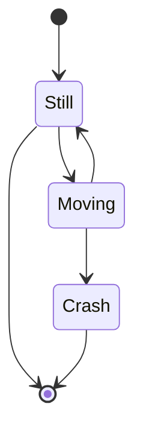

# Mermaid

## Useful links

[About Mermaid](https://mermaid-js.github.io/mermaid/#/)

[Mermaid on GitHub](https://github.com/mermaid-js/mermaid#readme)

[Sequence Diagrams](https://mermaid-js.github.io/mermaid/#/sequenceDiagram)

[Include diagrams in your Markdown files with Mermaid](https://github.blog/2022-02-14-include-diagrams-markdown-files-mermaid/)

[Diagram Syntax](https://mermaid-js.github.io/mermaid/#/n00b-syntaxReference?id=syntax-structure)

[Mermaid Cli](https://github.com/mermaid-js/mermaid-cli)

[Mermaid Live Editor](https://mermaid.live/edit#pako:eNpVkM-KwkAMxl8l5OSCfYEeBG3Vi6Cgt46H0InOIPOHdMoibd99p5aF3ZyS7_t9IWTANmjGEp9C0cCtVh5ybZvKiO2So-4ORbEZj5zABc_vEXarY4DOhBitf34t_G6GoBpOM8aQjPWvabGqT_7seYS6OVFMId7_OrfvMMK-sReT1_93jHBOHZoHlQ8qWhKoSD4IrtGxOLI6nz7MisJk2LHCMrea5KVQ-SlzfdSUeK9tCoJlkp7XSH0K17dvf-eFqS3lL7hFnH4ABg5bBA)

### Diagram samples  

Flowchart

```shell
flowchart LR
A[Hard] -->|Text| B(Round)
B --> C{Decision}
C -->|One| D[Result 1]
C -->|Two| E[Result 2]
```



Graph

```shell
  graph TD;
      A-->B;
      A-->C;
      B-->D;
      C-->D;
```


Squence Diagram

```shell
sequenceDiagram
    Alice->>John: Hello John, how are you?
    John-->>Alice: Great!
    Alice-)John: See you later!
```



Pie chart

```shell
    pie
    "Dogs" : 386
    "Cats" : 85
    "Rats" : 15
```



State Diagram

```shell
stateDiagram-v2
[*] --> Still
Still --> [*]
Still --> Moving
Moving --> Still
Moving --> Crash
Crash --> [*]
```


